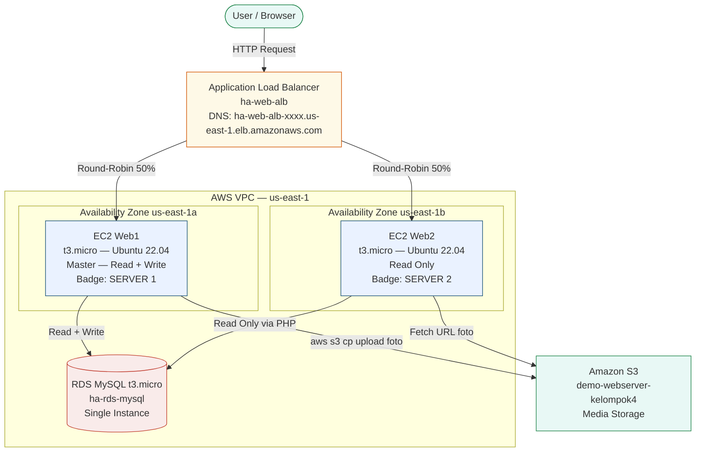

# HA Web Server — AWS Free Tier

Implementasi High Availability Web Server di Amazon Web Services menggunakan dua EC2 instance, RDS MySQL, S3, dan Application Load Balancer.

Arsitektur ini dikembangkan sebagai tugas besar mata kuliah Cloud Computing, Universitas Telkom 2026.

## Arsitektur



## Stack

| Layanan | Spesifikasi | Fungsi |
|---------|-------------|--------|
| EC2 x2 | t3.micro, Ubuntu 22.04 LTS | Web server PHP (Web1 R/W, Web2 Read-Only) |
| RDS MySQL | t3.micro, Free Tier | Database terpusat, diakses kedua instance |
| S3 | Standard, us-east-1 | Media storage foto pengguna |
| ALB | Application Load Balancer | Distribusi trafik round-robin + health check |
| IAM | EC2-S3-Role | Akses S3 dari EC2 tanpa static credentials |

## Prasyarat AWS

Sebelum deploy, siapkan semua komponen berikut secara berurutan:

- [ ] S3 Bucket dengan public read policy + ACLs enabled (Object Ownership)
- [ ] IAM Role `EC2-S3-Role` dengan policy `AmazonS3FullAccess` (attach ke Web1)
- [ ] Security Group `webserver-sg` — inbound SSH (22) My IP + HTTP (80) Anywhere
- [ ] Security Group `rds-sg` — inbound MySQL 3306 dari `webserver-sg`
- [ ] DB Subnet Group `db-subnet-group` — minimal 2 AZ (us-east-1a, us-east-1b)
- [ ] RDS MySQL `ha-rds-mysql` — Free Tier (db.t4g.micro), VPC Security Group: rds-sg
- [ ] EC2 Web1 — t3.micro Ubuntu 22.04, Security Group: webserver-sg
- [ ] EC2 Web2 — t3.micro Ubuntu 22.04, Security Group: webserver-sg
- [ ] ALB Target Group `ha-web-tg` — health check path: /health.php
- [ ] ALB `ha-web-alb` — Internet-facing, HTTP:80 → forward ke ha-web-tg

## Deploy

### Step 1 — Install dependensi (jalankan di Web1 DAN Web2)

```bash
sudo bash scripts/install-web1.sh   # di Web1
sudo bash scripts/install-web2.sh   # di Web2
```

Atau manual:

```bash
sudo apt update && sudo apt upgrade -y
sudo apt install -y apache2 php libapache2-mod-php php-mysql \
    php-curl php-mbstring php-xml php-zip unzip curl git
sudo a2enmod php8.5
sudo a2enmod rewrite
sudo systemctl restart apache2
```

### Step 2 — Clone dan deploy kode

**Di Web1:**
```bash
cd /var/www/html
sudo git clone https://github.com/srytmj/ha-webserver ha-webserver
sudo cp ha-webserver/web1/ha-webserver.conf /etc/apache2/sites-available/
sudo a2ensite ha-webserver.conf
sudo a2dissite 000-default.conf
sudo systemctl restart apache2
sudo chown -R www-data:www-data /var/www/html/ha-webserver
sudo chmod -R 755 /var/www/html/ha-webserver
```

**Di Web2:**
```bash
cd /var/www/html
sudo git clone https://github.com/srytmj/ha-webserver ha-webserver
sudo cp ha-webserver/web2/ha-webserver.conf /etc/apache2/sites-available/
sudo a2ensite ha-webserver.conf
sudo a2dissite 000-default.conf
sudo systemctl restart apache2
sudo chown -R www-data:www-data /var/www/html/ha-webserver
sudo chmod -R 755 /var/www/html/ha-webserver
```

### Step 3 — Edit konfigurasi database

**Web1** — `web1/config/database.php`:
```php
define('DB_HOST',      '[RDS_ENDPOINT]');
define('DB_PASS',      '[PASSWORD_RDS]');
define('SERVER_ID',    '1');
define('SERVER_LABEL', 'Web Server 1 — Master Node');
define('S3_BUCKET',    '[NAMA_BUCKET_S3]');
define('S3_BASE_URL',  'https://[NAMA_BUCKET_S3].s3.us-east-1.amazonaws.com/');
```

**Web2** — `web2/config/database.php`:
```php
define('DB_HOST',      '[RDS_ENDPOINT]');   // endpoint SAMA dengan Web1
define('DB_PASS',      '[PASSWORD_RDS]');
define('SERVER_ID',    '2');
define('SERVER_LABEL', 'Web Server 2 — Replica Node');
define('S3_BUCKET',    '[NAMA_BUCKET_S3]');
define('S3_BASE_URL',  'https://[NAMA_BUCKET_S3].s3.us-east-1.amazonaws.com/');
```

> Kedua instance menggunakan RDS endpoint yang sama. Pemisahan R/W dilakukan di level PHP — Web2 mengembalikan HTTP 403 untuk semua operasi tulis.

### Step 4 — Konfigurasi Apache Virtual Host

```bash
# Edit path DocumentRoot sesuai instance
sudo nano /etc/apache2/sites-available/ha-webserver.conf
# Web1: DocumentRoot /var/www/html/ha-webserver/web1/public
# Web2: DocumentRoot /var/www/html/ha-webserver/web2/public
sudo systemctl restart apache2
```

### Step 5 — Konfigurasi IAM Role (direkomendasikan) atau AWS CLI

**Opsi A — IAM Role (lebih aman, tidak perlu Access Key):**
```
EC2 Console → pilih Web1 → Actions → Security → Modify IAM role → pilih EC2-S3-Role
```

**Opsi B — AWS CLI manual:**
```bash
aws configure
# AWS Access Key ID     : [dari IAM User s3-webserver-user]
# AWS Secret Access Key : [dari IAM User s3-webserver-user]
# Default region        : us-east-1
# Default output format : json
```

Verifikasi:
```bash
aws sts get-caller-identity
aws s3 ls s3://[NAMA_BUCKET_S3]/
```

### Step 6 — Inisialisasi database

```bash
mysql -h [RDS_ENDPOINT] -u admin -p < /var/www/html/ha-webserver/database/init.sql
```

Atau manual:
```bash
mysql -h [RDS_ENDPOINT] -u admin -p
```
```sql
CREATE DATABASE ha_webserver;
USE ha_webserver;
CREATE TABLE user (
    id   INT NOT NULL AUTO_INCREMENT,
    nama VARCHAR(100) NOT NULL,
    nim  VARCHAR(20)  NOT NULL,
    foto VARCHAR(500) DEFAULT NULL,
    PRIMARY KEY (id),
    UNIQUE KEY uq_nim (nim)
) ENGINE=InnoDB DEFAULT CHARSET=utf8mb4;
```

### Step 7 — Redirect root ke login (opsional)

Sudah tersedia di `public/.htaccess`:
```apache
RewriteEngine On
RewriteRule ^$ /index.php?action=login [R=302,L]
```

## Verifikasi

```bash
# Health check langsung ke instance
curl http://[IP_WEB1]/health.php
# {"status":"healthy","server_id":"1","db":"connected"}

curl http://[IP_WEB2]/health.php
# {"status":"healthy","server_id":"2","db":"connected"}

# Uji ALB round-robin — jalankan dari terminal, gunakan DNS ALB
for i in {1..10}; do
  curl -s http://[ALB_DNS_NAME]/health.php | grep server_id
  sleep 0.5
done
# Output harusnya bergantian: "server_id":"1" dan "server_id":"2"

# Web2 harus tolak operasi tulis
curl -I http://[ALB_DNS_NAME]/index.php?action=create
# HTTP/1.1 403 Forbidden
```

## Akses Aplikasi

| Instance | URL | Mode |
|----------|-----|------|
| Via ALB (recommended) | `http://[ALB_DNS_NAME]/index.php?action=login` | Round-robin |
| Web1 langsung | `http://[IP_WEB1]/index.php?action=login` | Read + Write |
| Web2 langsung | `http://[IP_WEB2]/index.php?action=login` | Read Only |

Login default: `admin` / `password123` — **ganti di `loginController.php` untuk produksi.**

## Perbedaan Web1 vs Web2

| Fitur | Web1 (Master) | Web2 (Replica) |
|-------|---------------|----------------|
| Login | ya | ya |
| Lihat Data | ya | ya |
| Tambah User | ya | tidak (403) |
| Edit User | ya | tidak (403) |
| Hapus User | ya | tidak (403) |
| Upload S3 | ya | tidak |
| CPU Stress Test | ya | ya |
| DB Endpoint | RDS Endpoint | RDS Endpoint (sama) |
| Server Badge | Hijau — Server 1 | Oranye — Server 2 |

## Update Kode

```bash
cd /var/www/html/ha-webserver
sudo git pull
sudo chown -R www-data:www-data .
```

## Troubleshooting

Lihat [docs/TROUBLESHOOTING.md](docs/TROUBLESHOOTING.md) untuk daftar lengkap masalah dan solusinya.

## Dokumentasi

| File | Isi |
|------|-----|
| [docs/TROUBLESHOOTING.md](docs/TROUBLESHOOTING.md) | Masalah umum dan solusinya — credentials, ACL, Apache, ALB, RDS |
| [docs/GLOSSARY.md](docs/GLOSSARY.md) | Definisi istilah teknis: AWS services, arsitektur, PHP & web |
| [docs/CHANGELOG.md](docs/CHANGELOG.md) | History perubahan arsitektur dari v1.0.0 ke v2.0.0 |

## Struktur Repo

```
ha-webserver/
├── web1/                      # Kode Web Instance 1 (Master R/W)
│   ├── public/
│   │   ├── index.php          # Front controller
│   │   ├── health.php         # ALB health check endpoint
│   │   ├── stress.php         # CPU stress test untuk CloudWatch
│   │   └── .htaccess
│   ├── controller/
│   │   ├── loginController.php
│   │   ├── mainController.php
│   │   └── userController.php # Eksklusif Web1 (CRUD + S3 upload)
│   ├── model/User.php
│   ├── view/
│   │   ├── login.php
│   │   ├── main.php
│   │   ├── read.php
│   │   ├── create.php         # Eksklusif Web1
│   │   └── update.php         # Eksklusif Web1
│   ├── config/database.php
│   ├── ha-webserver.conf      # Apache VirtualHost config
│   └── deploy-web1.sh
├── web2/                      # Kode Web Instance 2 (Read-Only)
│   ├── public/
│   │   ├── index.php          # Front controller (tanpa CRUD routes)
│   │   ├── health.php
│   │   ├── stress.php
│   │   └── .htaccess
│   ├── controller/
│   │   ├── loginController.php
│   │   └── mainController.php # Tanpa userController
│   ├── model/User.php
│   ├── view/
│   │   ├── login.php
│   │   ├── main.php
│   │   └── read.php           # Tanpa create/update
│   ├── config/database.php
│   ├── ha-webserver.conf
│   └── deploy-web2.sh
├── database/
│   └── init.sql               # Schema dan sample data
├── scripts/
│   ├── install-web1.sh        # Install dependensi Web1
│   └── install-web2.sh        # Install dependensi Web2
├── .github/workflows/
│   ├── ci.yml                 # CI check
│   └── sync.yml               # Auto-sync ke repo web1/web2
├── docs/
│   ├── TROUBLESHOOTING.md     # Masalah dan solusi dari implementasi nyata
│   ├── GLOSSARY.md            # Definisi istilah teknis
│   └── CHANGELOG.md           # History perubahan arsitektur
```